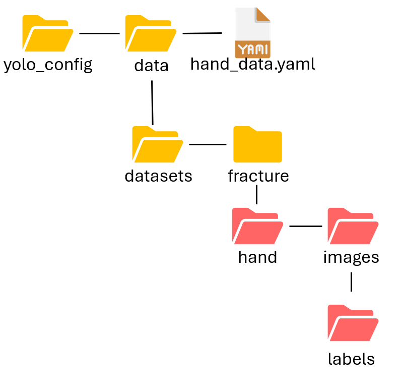

# Fractured Scaphoid Detection

Use [Faster R-CNN](https://arxiv.org/abs/1506.01497) and YOLOv11-[OBB](https://docs.ultralytics.com/datasets/obb/) to detect the scaphoid fracture location.

## Model

| Name | Description | path|
|---|---|---|
|ScaphoidDetector| Detects scaphoid bone in X-ray hand images using [Faster R-CNN](https://arxiv.org/abs/1506.01497)| `scaphoid_detector.py`|
|FractureClassifier| Classify scaphoid fractures using [VGG16](https://pytorch.org/vision/main/models/generated/torchvision.models.vgg16.html) pre-trained model after detection by ScaphoidDetector | `fracture_classifier.py`|
|HandDetector| Detects scaphoid bones and fractures region in X-ray hand image using YOLOv11-[OBB](https://docs.ultralytics.com/datasets/obb/)|`hand_detector.py`|

## Methods

1. **ScaphoidDetector + FractureClassifier + HandDetector**\
First, use Faster R-CNN to detect the scaphoid bone in the full X-ray hand image. Then, use VGG16 to classify whether there is a fracture. Finally, use YOLOv11-obb to detect the fracture location.

2. **HandDetector**\
Directly use YOLOv11-obb to detect the scaphoid bone and fracture locations.

## ScaphoidDetector + FractureClassifier + HandDetector
### Datasets

### Training

### Detect

## HandDetector
### Datasets

### Training

### Detect
Detect the scaphoid bone and fractures in X-ray hand images. Choose the coordinates with the highest confidence and plot the bounding boxes.

## References
- [The Detection and Classification of Scaphoid Fractures in Radiograph by Using a Convolutional Neural Network](https://pubmed.ncbi.nlm.nih.gov/39518391/)
- [Oriented Bounding Box (OBB) Datasets Overview](https://docs.ultralytics.com/datasets/obb/)
