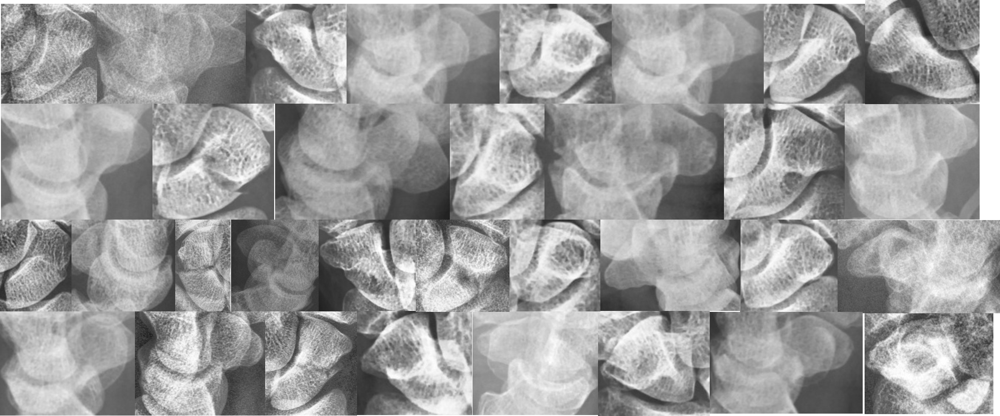

# Fractured Scaphoid Detection

Use [Faster R-CNN](https://arxiv.org/abs/1506.01497) and YOLOv11-[OBB](https://docs.ultralytics.com/datasets/obb/) to detect the scaphoid fracture location.

## Get Started
1. Configuration
    ```bash
    git clone https://github.com/Hlunlun/Fractured-Scaphoid-Detection
    cd Fractured-Scaphoid-Detection
    conda env create --file environment.yml
    ```
2. Run
    - Training 
        ```bash
        python main.py --train 1
        ```
    - Start System
        ```bash
        python main.py
        ```

## Model

| Name | Description | path|
|---|---|---|
|ScaphoidDetector| Detects scaphoid bone in X-ray hand images using [Faster R-CNN](https://arxiv.org/abs/1506.01497)| `scaphoid_detector.py`|
|FractureClassifier| Classify scaphoid fractures using [VGG16](https://pytorch.org/vision/main/models/generated/torchvision.models.vgg16.html) pre-trained model after detection by ScaphoidDetector | `fracture_classifier.py`|
|HandDetector| Detects scaphoid bones and fractures region in X-ray hand image using YOLOv11-[OBB](https://docs.ultralytics.com/datasets/obb/)|`hand_detector.py`|


## Methods

1. **ScaphoidDetector + FractureClassifier + HandDetector**\
First, use Faster R-CNN to detect the scaphoid bone in the full X-ray hand image. Then, use VGG16 to classify whether there is a fracture. Finally, use YOLOv11-obb to detect the fracture location.

2. **HandDetector**\
Directly use YOLOv11-obb to detect the scaphoid bone and fracture locations.


## ScaphoidDetector + FractureClassifier + HandDetector
### Traning Datasets
1. File Structure
    ```
    ip_data  
    ├── fracture_detection  
    │   └── annotations         // Fracture locations: rectangle coordinates [[x1, y1], [x2, y2], [x3, y3], [x4, y4]]  
    └── scaphoid_detection  
        ├── annotations         // Scaphoid locations: rectangle coordinates of the upper-left and lower-right corners [x1, y1, x2, y2]  
        └── images              // Hand X-ray images  
    ```
2. After data preprocessing in `dataset.py`, `all_datas.json` and new folders will be created under fracture_detection and scaphoid_detection:
    ```
    ├── ip_data
        ├── fracture_detection
        │   ├── annotations
        │   ├── images
        │   └── images_rec
        └── scaphoid_detection
            ├── annotations
            ├── images
            └── images_rec
    ├── all_datas.json
    ```
    - `fracture_detection/`
        - `images/`: Contains the full scaphoid images cropped based on scaphoid locations.
        - `images_rec/`: Contains the scaphoid images with highlighted fracture locations.
        ```
        fracture_detection
        ├── annotations
        ├── images
        └── images_rec
        ```
    - `fracture_detection/images_rec`: Stores hand images with the scaphoid region framed.
    
### Training
1. Train ScaogiudDetector
    ```python
    from scahpoid_detector import ScaphoidDetector
    scaphoid_detector = ScaphoidDetector(args)
    scaphoid_detector.train()
    ```

2. Train FractureClassifier
    ```python
    from fracture_classifier import FractureClassifier
    fracture_classifier = FractureClassifier(args)
    fracture_classifier.train()
    ```

3. Train HandDetector
    ```python
    from hand_detector import HandDetector
    hand_detector = HandDetector(args)
    hand_detector.train()
    ```


### Detect
Steps 1. Detect Scaphoid

- Use `detect()` function
    
    ```python
    scaphoid_detector.detect(dir_path)
    ```
    
- Detected scaphoid location will be cropped and saved in `prediction/scaphoid/`
        

Steps 2. Classify fracture

- Use `classify()` function
    
    ```python
    fracture_classifier.classify(dir_path)
    ```
    
- Fracture scaphoid will be saved in `prediction/classifier/`

Steps 3. Detect fracture location

- Use `detect_fracture()` function
- The images with marked fracture locations will be saved in `prediction/fracture/`
    


## HandDetector
### Training Datasets
使用 `yolo_anno.py` 內的函數來建構 YOLOv11-OBB的資料
1. File Structure
    ```
    yolo_config
    ├── data
    ├── datasets
    │   ├── fracture
    │   │   ├── images
    │   │   │   ├── train
    │   │   │   └── val
    │   │   └── labels
    │   │       ├── train
    │   │       └── val
    │   └── hand
    │       ├── images
    │       │   ├── train
    │       │   └── val
    │       └── labels
    │           ├── train
    │           └── val
    └── weights
    ```

### Training
1. Train hand detector
    ```python
    from hand_detector import HandDetector
    hand_detector = HandDetector(args)
    hand_detector.train()
    ```
2. Curve will be in `runs/`


### Results
1. After prediting\
    

### Detect
Detect the scaphoid bone and fractures in X-ray hand images. Choose the coordinates with the highest confidence and plot the bounding boxes.


## System
Load a folder containing the dataset file structure. The system will then begin predicting and save the images with the scaphoid and fracture locations highlighted.


## References
- [The Detection and Classification of Scaphoid Fractures in Radiograph by Using a Convolutional Neural Network](https://pubmed.ncbi.nlm.nih.gov/39518391/)
- [Oriented Bounding Box (OBB) Datasets Overview](https://docs.ultralytics.com/datasets/obb/)
